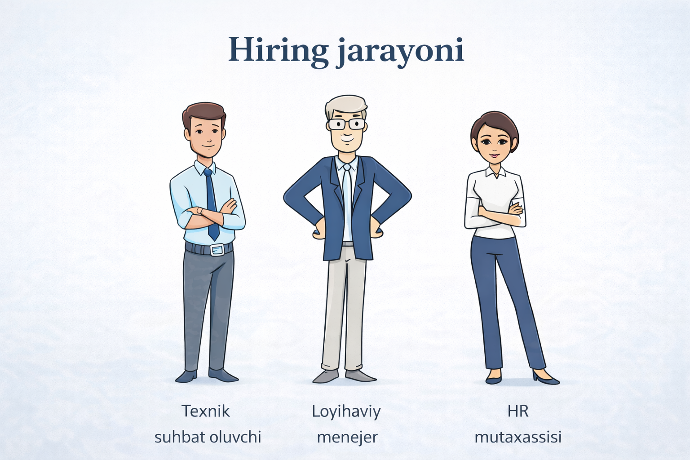

# Hiring Workflow Demonstration (Without Chain of Responsibility)

Bu loyiha **Chain of Responsibility design pattern ishlatilmagan holatda** intervyu jarayonidagi muammolarni ko‘rsatadi.

Quyidagi kod orqali nomzod ketma-ket uchta bosqichdan o‘tkaziladi:

* Technical Round
* Manager Round
* HR Round

## Client kodi

```java
import interview.HrRound;
import interview.ManagerRound;
import interview.TechnicalRound;
import interview.domain.Candidate;

public class Client {
    public static void main(String[] args) {
        Candidate candidate = Candidate.builder()
                .name("Thomas")
                .score(85)
                .build();

        var technicalRound = new TechnicalRound();
        var managerRound = new ManagerRound();
        var hrRound = new HrRound();

        var tech = technicalRound.hire(candidate);
        var man = managerRound.hire(candidate);
        var hr = hrRound.hire(candidate);

        if (hr) System.out.println("Pass");
        else System.out.println("Failed");
    }
}
```

---

## Asosiy Dizayn Muammolari

### 1. Tight Coupling (Qattiq bog‘lanish)

`Client` klassi har bir intervyu bosqichiga to‘g‘ridan-to‘g‘ri bog‘langan.

Bu quyidagi muammolarga olib keladi:

* Har bir yangi bosqich qo‘shilganda `Client` kodini o‘zgartirish kerak bo‘ladi.
* Bosqichlarni noto‘g‘ri chaqirish ehtimoli mavjud.
* Kod kengaytirilishi qiyin.

### 2. Manual Workflow Orchestration (Jarayonni qo‘lda boshqarish)

Intervyu jarayoni **Client tomonidan qo‘lda boshqarilmoqda**.

Natijada:

* Bosqichlar ketma-ketligi tizim tomonidan kafolatlanmaydi.
* Bosqichlar noto‘g‘ri tartibda yoki umuman chaqirilmasligi mumkin.
* Dastur ishga tushadi, lekin jarayon noto‘g‘ri ishlashi mumkin.

---

## Xulosa

Bu yondashuv:

* Moslashuvchan emas
* Xatolarga juda ochiq
* Arxitektura jihatidan noto‘g‘ri

Shu sababli **Chain of Responsibility pattern** bu muammolarni hal qilish uchun ishlatiladi.


