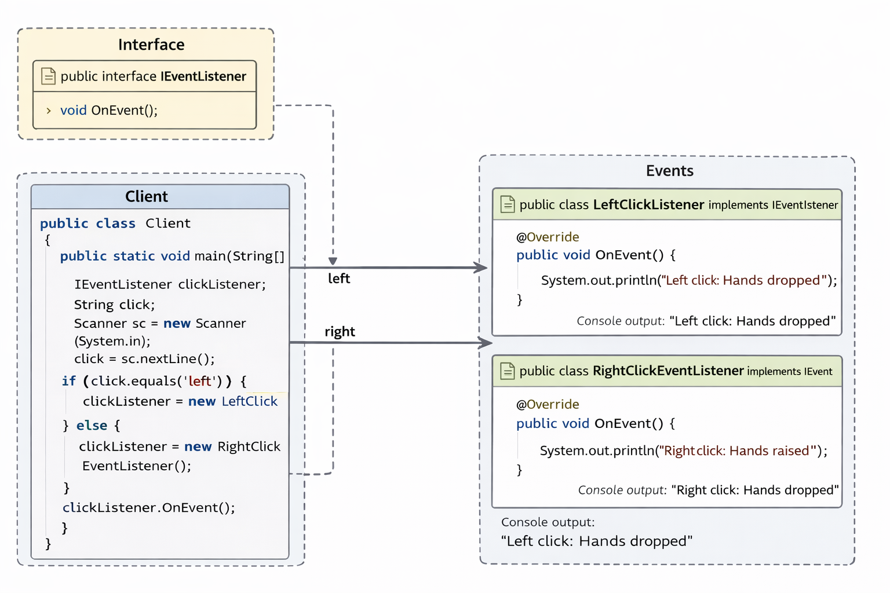

# Command Pattern ishlatilmagan holatdagi muammolar

Bu loyiha **Command Design Pattern qo‘llanmagan** arxitekturani ko‘rsatadi.
Client (UI) qaysi harakat bajarilishini o‘zi hal qiladi.

---

## 1. Behavior o‘zgarsa → Client kodini ham o‘zgartirish kerak

Hozir Client command’ni `if/else` orqali tanlaydi:

```java
if (click.equals("left")) {
    clickListener = new LeftClickListener();
} else {
    clickListener = new RightClickEventListener();
}
clickListener.OnEvent();
```

Agar command ichidagi logika o‘zgarsa yoki yangi command qo‘shilsa,
**Client’ni qayta yozishga majbur bo‘lasiz.**

Bu esa UI va harakatlar o‘rtasida **tight coupling** borligini bildiradi.

---

## 2. Yangi Client yozilganda → shu mapping logikasi takrorlanadi

Agar boshqa Client yaratilsa (GUI, REST API, test runner),
u ham yuqoridagi `if/else` tanlash logikasini yana yozadi.

Natija:

* Kod dublikat bo‘ladi
* Maintain qilish qiyinlashadi
* Har bir Client command’larni bilishga majbur

---

## Xulosa

Bu muammolar shuni ko‘rsatadiki:

* Harakatlar alohida obyektlar bo‘lsa ham, ular markaziy boshqaruvsiz
* UI (Client) business logic’ga qattiq bog‘langan

Shu sababli **Command Pattern qo‘llanadi**:

* Client faqat `execute()` chaqiradi
* Command ichida business logic yashirinadi
* Yangi command qo‘shish Client’ni o‘zgartirmaydi




