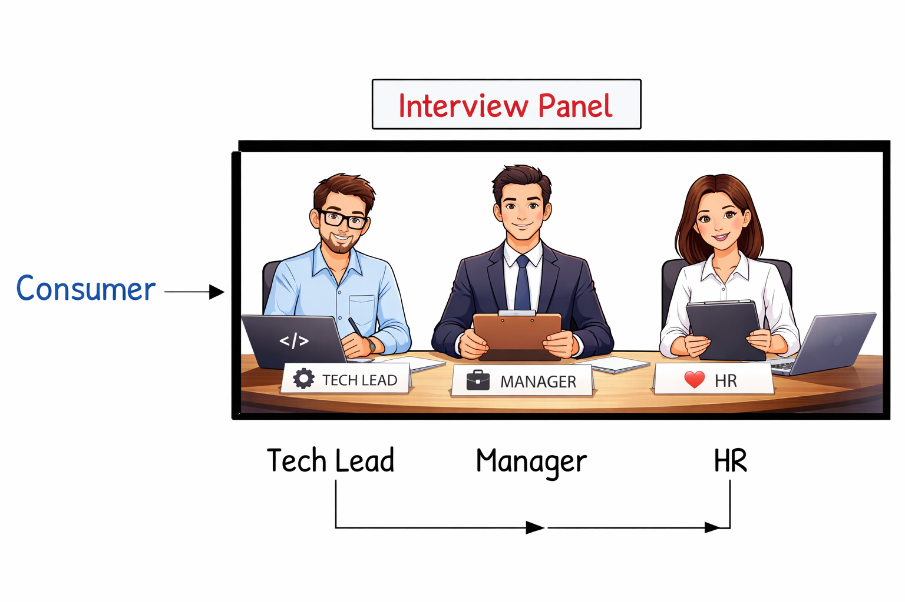

# Hiring Jarayoni – Dizayn Taqqoslash

Ushbu hujjat **Chain of Responsibility (CoR)** design pattern ishlatilmagan va ishlatilgan holatdagi hiring jarayonini taqqoslaydi.

---

## ❌ Pattern ishlatilmagan holat

Dastlabki versiyada **Client** har bir bosqichni o‘zi yaratadi va chaqiradi:

* TechnicalRound
* ManagerRound
* HrRound

Workflow qo‘lda boshqariladi:

```
technical.hire(candidate)
manager.hire(candidate)
hr.hire(candidate)
```

### Muammolar

**Tight Coupling (qattiq bog‘lanish)**
Client har bir concrete round’ga bog‘langan. Jarayon o‘zgarsa — Client ham o‘zgarishi kerak.

**Manual Orchestration (qo‘lda boshqarish)**
Client jarayon tartibini boshqaradi. Bu esa xatolarga juda ochiq.

---

## ✅ Pattern ishlatilgan holat (Solution Demonstration)

Yechimda Client faqat bitta entry point bilan ishlaydi:

```
InterviewPanel panel = new InterviewPanel();
panel.hire(candidate);
```

`InterviewPanel` ichida chain quriladi:

```
Technical → Manager → HR
```

Har bir round:

1. Candidate’ni tekshiradi
2. Fail bo‘lsa — jarayonni to‘xtatadi
3. Pass bo‘lsa — keyingi round’ga uzatadi

Shu bilan:

* Bosqichlar ketma-ketligi kafolatlanadi
* Client faqat panel’ni biladi
* Workflow moslashuvchan va kengaytiriladigan bo‘ladi

---

## Xulosa

**Chain of Responsibility pattern** yordamida hiring jarayoni:

* Barqaror
* Kengaytiriladigan
* Xatolarga chidamli

Bu esa real loyihalarda professional arxitektura qurish imkonini beradi.

